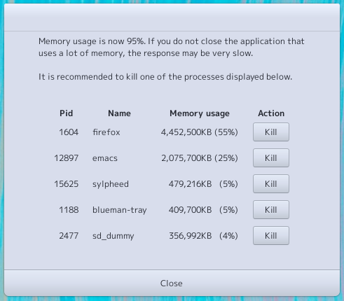

Watchmem
================================================================================

This application warns you before a memory-hungry process on desktop Linux makes
your entire desktop unresponsive, giving you the option to kill the process.

When total memory usage reached up to 95%, a dialog window will pop up as follows:

Press one of the buttons in this dialog to kill the memory-intensive process.
Of cource all of these processes are of current user process. (not of root)

This is a confirm dialog that appears after clicking a kill button.

Prerequisites
--------------------------------------------------------------------------------

+ Gnu/Linux operating system (it monitors `/proc`)
+ Gcc + make
+ GLib
+ Gtk+3
+ Vala compiler (maybe 0.50 or later)
+ libgee-0.8

How to install
--------------------------------------------------------------------------------

On commandline:

	make

This command will compile source files and create executable named `watchmem` in the
current directory.
Copy this file to your `bin` directory wherever the `$PATH` environment variable
contains.

	cp ./watchmem ~/.local/bin

If there is already another `watchmem` command, you might simply rename this file then all
goes fine.

How to execute
--------------------------------------------------------------------------------

Simply execute command as a background process as

	watchmem &

Mechanism
--------------------------------------------------------------------------------

This application will monitor `/proc/meminfo` after launching and display a dialog
when total memory usage reaches 95% (look MemAvailable / MemTotal). There is no
particular basis for this number, but I managed to do so.

And the processes to be killed refers to the `VmSize` value that can be obtained from `status`
file in the directory in `/proc/${PID}`, and displays the process with the highest
memory usage from the top to the fifth.

In other words, it's like a handy script.
I wrote it overnight, but I haven't tested it well and its usefulness is still unknown.

Enjoy happy hacking!

(C) 2021 Takayuki Tanaka.
